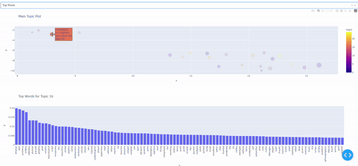
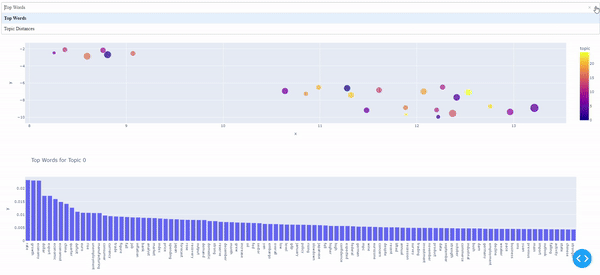
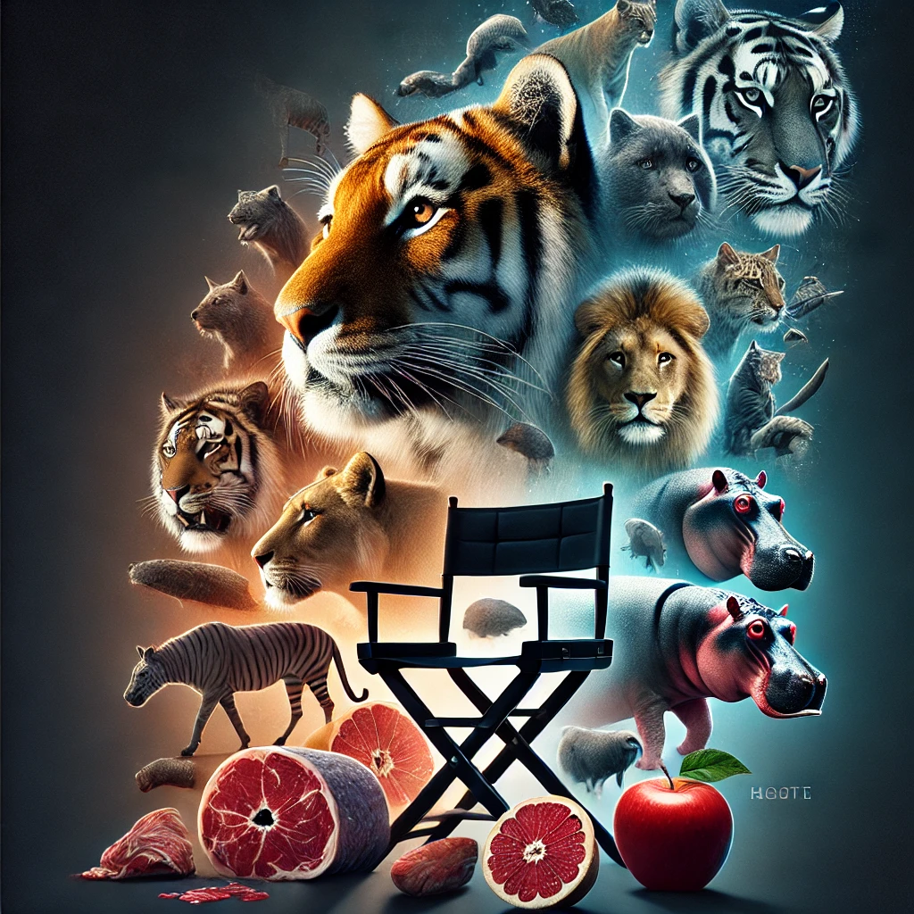

<div align="center">
  


[](https://pypi.org/project/stream_topic)

[](https://stream_topic.readthedocs.io/en/latest/?badge=latest)
[](https://stream-topic.readthedocs.io/en/latest/index.html)
[](https://github.com/AnFreTh/STREAM/issues)


[📘Documentation](https://stream-topic.readthedocs.io/en/latest/index.html) |
[🛠️Installation](https://stream-topic.readthedocs.io/en/latest/installation.html) |
[Models](https://stream-topic.readthedocs.io/en/latest/api/models/index.html) |
[🤔Report Issues](https://github.com/AnFreTh/STREAM/issues)
</div>


# STREAM
We present STREAM, a Simplified Topic Retrieval, Exploration, and Analysis Module for user-friendly topic modelling and especially subsequent interactive topic visualization and analysis. Our paper can be found [here](https://aclanthology.org/2024.acl-short.41.pdf).


<table>
  <tr>
    <td></td>
    <td></td>
  </tr>
</table>

# Table of Contents
- [STREAM](#stream)
- [Table of Contents](#table-of-contents)
- [Installation](#installation)
- [Available Models](#available-models)
- [Available Metrics](#available-metrics)
- [Available Datasets](#available-datasets)
- [Usage](#usage)
  - [Preprocessing](#preprocessing)
  - [Model fitting](#model-fitting)
  - [Evaluation](#evaluation)
  - [Hyperparameter optimization](#hyperparameter-optimization)
  - [Visualization](#visualization)
  - [Downstream Tasks](#downstream-tasks)
    - [How to use](#how-to-use)
- [🧪 Experimental 🧪](#-experimental-)
- [Contributing and Testing New Models](#contributing-and-testing-new-models)
  - [Steps for Contributing](#steps-for-contributing)
    - [Example Model Structure](#example-model-structure)
    - [Testing Your Model](#testing-your-model)
      - [Validation Criteria](#validation-criteria)
    - [Submitting Your Contribution](#submitting-your-contribution)
- [Citation](#citation)


For better topic analysis, we implement multiple intruder-word based topic evaluation metrics. Additionally, we publicize multiple new datasets that can extend the so far very limited number of publicly available benchmark datasets in topic modeling. We integrate downstream interpretable analysis modules to enable users to easily analyse the created topics in downstream tasks together with additional tabular information.


Installation
=============
stream_topic is available on PyPI. To install STREAM, you can either install it directly from the GitHub repository using the following command:

```sh
pip install git+https://github.com/AnFreTh/STREAM.git
```
or simply install via:
```sh
pip install stream_topic
```
Make additionally sure to download the necessary [nltk](https://www.nltk.org/) ressources, e.g. via:

```python
import nltk
nltk.download('stopwords')
nltk.download('punkt')
nltk.download('wordnet')
nltk.download('averaged_perceptron_tagger')
```

# Available Models
STREAM offers a variety of neural as well as non-neural topic models and we are always trying to incorporate more and new models. If you wish to incorporate your own model, or want another model incorporated please raise an issue with the required information. Currently, the following models are implemented:

<div align="center" style="width: 100%;">
  <table style="margin: 0 auto;">
    <thead>
      <tr>
        <th><strong>Name</strong></th>
        <th><strong>Implementation</strong></th>
      </tr>
    </thead>
    <tbody>
      <tr>
        <td><a href="https://www.jmlr.org/papers/volume3/blei03a/blei03a.pdf?ref=http://githubhelp.com">LDA</a></td>
        <td>Latent Dirichlet Allocation</td>
      </tr>
      <tr>
        <td><a href="https://www.nature.com/articles/44565">NMF</a></td>
        <td>Non-negative Matrix Factorization</td>
      </tr>
      <tr>
        <td><a href="https://arxiv.org/abs/2004.14914">WordCluTM</a></td>
        <td>Tired of topic models?</td>
      </tr>
      <tr>
        <td><a href="https://direct.mit.edu/coli/article/doi/10.1162/coli_a_00506/118990/Topics-in-the-Haystack-Enhancing-Topic-Quality?searchresult=1">CEDC</a></td>
        <td>Topics in the Haystack</td>
      </tr>
      <tr>
        <td><a href="https://arxiv.org/pdf/2212.09422.pdf">DCTE</a></td>
        <td>Human in the Loop</td>
      </tr>
      <tr>
        <td><a href="https://direct.mit.edu/coli/article/doi/10.1162/coli_a_00506/118990/Topics-in-the-Haystack-Enhancing-Topic-Quality?searchresult=1">KMeansTM</a></td>
        <td>Simple Kmeans followed by c-tfidf</td>
      </tr>
      <tr>
        <td><a href="https://citeseerx.ist.psu.edu/document?repid=rep1&type=pdf&doi=b3c81b523b1f03c87192aa2abbf9ffb81a143e54">SomTM</a></td>
        <td>Self organizing map followed by c-tfidf</td>
      </tr>
      <tr>
        <td><a href="https://ieeexplore.ieee.org/abstract/document/10066754">CBC</a></td>
        <td>Coherence based document clustering</td>
      </tr>
      <tr>
        <td><a href="https://arxiv.org/pdf/2403.03737">TNTM</a></td>
        <td>Transformer-Representation Neural Topic Model</td>
      </tr>
      <tr>
        <td><a href="https://direct.mit.edu/tacl/article/doi/10.1162/tacl_a_00325/96463/Topic-Modeling-in-Embedding-Spaces">ETM</a></td>
        <td>Topic modeling in embedding spaces</td>
      </tr>
      <tr>
        <td><a href="https://arxiv.org/abs/2004.03974">CTM</a></td>
        <td>Combined Topic Model</td>
      </tr>
      <tr>
        <td><a href="https://arxiv.org/abs/2303.14951">CTMNeg</a></td>
        <td>Contextualized Topic Models with Negative Sampling</td>
      </tr>
      <tr>
        <td><a href="https://arxiv.org/abs/1703.01488">ProdLDA</a></td>
        <td>Autoencoding Variational Inference For Topic Models</td>
      </tr>
      <tr>
        <td><a href="https://arxiv.org/abs/1703.01488">NeuralLDA</a></td>
        <td>Autoencoding Variational Inference For Topic Models</td>
      </tr>
    </tbody>
  </table>
</div>


# Available Metrics
Since evaluating topic models, especially automatically, STREAM implements numerous evaluation metrics. Especially, the intruder based metrics, while they might take some time to compute, have shown great correlation with human evaluation. 
<div align="center" style="width: 100%;">
  <table style="margin: 0 auto;">
  <thead>
    <tr>
      <th><strong>Name</strong></th>
      <th><strong>Description</strong></th>
    </tr>
  </thead>
  <tbody>
    <tr>
      <td><a href="https://direct.mit.edu/coli/article/doi/10.1162/coli_a_00506/118990/Topics-in-the-Haystack-Enhancing-Topic-Quality?searchresult=1">ISIM</a></td>
      <td>Average cosine similarity of top words of a topic to an intruder word.</td>
    </tr>
    <tr>
      <td><a href="https://direct.mit.edu/coli/article/doi/10.1162/coli_a_00506/118990/Topics-in-the-Haystack-Enhancing-Topic-Quality?searchresult=1">INT</a></td>
      <td>For a given topic and a given intruder word, Intruder Accuracy is the fraction of top words to which the intruder has the least similar embedding among all top words.</td>
    </tr>
    <tr>
      <td><a href="https://direct.mit.edu/coli/article/doi/10.1162/coli_a_00506/118990/Topics-in-the-Haystack-Enhancing-Topic-Quality?searchresult=1">ISH</a></td>
      <td>Calculates the shift in the centroid of a topic when an intruder word is replaced.</td>
    </tr>
    <tr>
      <td><a href="https://direct.mit.edu/coli/article/doi/10.1162/coli_a_00506/118990/Topics-in-the-Haystack-Enhancing-Topic-Quality?searchresult=1">Expressivity (experimental) </a></td>
      <td>Cosine Distance of topics to meaningless (stopword) embedding centroid</td>
    </tr>
    <tr>
      <td><a href="https://link.springer.com/chapter/10.1007/978-3-030-80599-9_4">Embedding Topic Diversity</a></td>
      <td>Topic diversity in the embedding space</td>
    </tr>
    <tr>
      <td><a href="https://direct.mit.edu/coli/article/doi/10.1162/coli_a_00506/118990/Topics-in-the-Haystack-Enhancing-Topic-Quality?searchresult=1">Embedding Coherence</a></td>
      <td>Cosine similarity between the centroid of the embeddings of the stopwords and the centroid of the topic.</td>
    </tr>
    <tr>
      <td><a href="https://aclanthology.org/E14-1056.pdf">NPMI</a></td>
      <td>Classical NPMi coherence computed on the source corpus.</td>
    </tr>
  </tbody>
</table>
</div>


# Available Datasets
To integrate custom datasets for modeling with STREAM, please follow the example notebook in the examples folder. For benchmarking new models, STREAM already includes the following datasets:
<div align="center" style="width: 100%;">
  <table style="margin: 0 auto;">
  <thead>
    <tr>
      <th>Name</th>
      <th># Docs</th>
      <th># Words</th>
      <th># Features</th>
      <th>Description</th>
    </tr>
  </thead>
  <tbody>
    <tr>
      <td>Spotify_most_popular</td>
      <td>5,860</td>
      <td>18,193</td>
      <td>17</td>
      <td>Spotify dataset comprised of popular song lyrics and various tabular features.</td>
    </tr>
    <tr>
      <td>Spotify_least_popular</td>
      <td>5,124</td>
      <td>20,168</td>
      <td>14</td>
      <td>Spotify dataset comprised of less popular song lyrics and various tabular features.</td>
    </tr>
    <tr>
      <td>Spotify</td>
      <td>11,012</td>
      <td>25,835</td>
      <td>14</td>
      <td>General Spotify dataset with song lyrics and various tabular features.</td>
    </tr>
    <tr>
      <td>Reddit_GME</td>
      <td>21,559</td>
      <td>11,724</td>
      <td>6</td>
      <td>Reddit dataset filtered for "Gamestop" (GME) from the Subreddit "r/wallstreetbets".</td>
    </tr>
    <tr>
      <td>Stocktwits_GME</td>
      <td>300,000</td>
      <td>14,707</td>
      <td>3</td>
      <td>Stocktwits dataset filtered for "Gamestop" (GME), covering the GME short squeeze of 2021.</td>
    </tr>
    <tr>
      <td>Stocktwits_GME_large</td>
      <td>600,000</td>
      <td>94,925</td>
      <td>0</td>
      <td>Larger Stocktwits dataset filtered for "Gamestop" (GME), covering the GME short squeeze of 2021.</td>
    </tr>
    <tr>
      <td>Reuters</td>
      <td>10,788</td>
      <td>19,696</td>
      <td>-</td>
      <td>Preprocessed Reuters dataset.</td>
    </tr>
    <tr>
      <td>Poliblogs</td>
      <td>13,246</td>
      <td>47,106</td>
      <td>2</td>
      <td>Preprocessed Poliblogs dataset suitable for STMs.</td>
    </tr>
    <tr>
      <td>20NewsGroups</td>
      <td>18,846</td>
      <td>70,461</td>
      <td>-</td>
      <td>preprocessed 20NewsGroups dataset</td>
    </tr>
    <tr>
      <td>BBC_News</td>
      <td>2,225</td>
      <td>19,116</td>
      <td>-</td>
      <td>preprocessed BBC News dataset</td>
    </tr>
  </tbody>
</table>
</div>
If you wish yo include and publish one of your datasets directly into the package, feel free to contact us.


# Usage
To use one of the available models, follow the simple steps below:
1. Import the necessary modules:

    ```python
    from stream_topic.models import KmeansTM
    from stream_topic.utils import TMDataset
    ```
## Preprocessing
2. Get your dataset and preprocess for your model:
    ```python
    dataset = TMDataset()
    dataset.fetch_dataset("20NewsGroup")
    dataset.preprocess(model_type="KmeansTM")
    ```

The specified model_type is optional and further arguments can be specified. Default steps are predefined for all included models.
Steps like stopword removal and lemmatizing are automatically performed for models like e.g. LDA.

## Model fitting
Fitting a model from STREAM follows a simple, sklearn-like logic and every model can be fit identically.

3. Choose the model you want to use and train it:
   
    ```python
    model = KmeansTM()
    model.fit(dataset, n_topics=20)
    ```

Depending on the model, check the documentation for hyperparameter settings. To get the topics, simply run:

1. Get the topics:
    ```python
    topics = model.get_topics()
    ```

## Evaluation

stream-topic implements various evaluation metrics, mostly focused around the intruder word task. The implemented metrics achieve high correlations with human evaluation. See [here](https://direct.mit.edu/coli/article/doi/10.1162/coli_a_00506/118990/Topics-in-the-Haystack-Enhancing-Topic-Quality?searchresult=1) for the detailed description of the metrics.


To evaluate your model simply use one of the metrics.
```python
from stream_topic.metrics import ISIM, INT, ISH, NPMI

metric = ISIM()
metric.score(topics)
```

Scores for each topic are available via:
```python
metric.score_per_topic(topics)
```

To leverage one of the metrics available in [octis](https://github.com/MIND-Lab/OCTIS), simply create a model output that fits within the octis' framework

```python
from octis.evaluation_metrics.diversity_metrics import TopicDiversity

model_output = {"topics": model.get_topics(), "topic-word-matrix": model.get_beta(), "topic-document-matrix": model.get_theta()}

metric = TopicDiversity(topk=10) # Initialize metric
topic_diversity_score = metric.score(model_output)

```

Similarly to use one of STREAMS metrics for any model, use the topics and occasionally the $\beta$ (topic-word-matrix) of the model to calculate the score.

## Hyperparameter optimization
If you want to optimize the hyperparameters, simply run:
```python
model.optimize_and_fit(
    dataset,
    min_topics=2,
    max_topics=20,
    criterion="aic",
    n_trials=20,
)
```
## Visualization
You can also specify to optimize with respect to any evaluation metric from stream_topic.
Visualize the results:

```python
from stream_topic.visuals import visualize_topic_model,visualize_topics
visualize_topic_model(
    model, 
    reduce_first=True, 
    port=8051,
    )
```

<p align="center">
    
</p>

## Downstream Tasks
STREAM offers an interpretable downstream task model, following additive models.
The general architecture of a Neural Additive Model (NAM) is described by [Agarwal et al. (2021)](https://proceedings.neurips.cc/paper/2021/file/251bd0442dfcc53b5a761e050f8022b8-Paper.pdf).

See [stream](https://aclanthology.org/2024.acl-short.41.pdf) for the detailed model description within the stream-topic framework.


### How to use

```python
from lightning import Trainer
from stream_topic.NAM import DownstreamModel

# Instantiate the DownstreamModel
downstream_model = DownstreamModel(
    trained_topic_model=topic_model,
    target_column='target',  # Target variable
    task='regression',  # or 'classification'
    dataset=dataset,  
    batch_size=128,
    lr=0.0005
)

# Use PyTorch Lightning's Trainer to train and validate the model
trainer = Trainer(max_epochs=10)
trainer.fit(downstream_model)

# Plotting
from stream_topic.visuals import plot_downstream_model
plot_downstream_model(downstream_model)
```

# 🧪 Experimental 🧪
stream-topic.experimental includes several experimental topic representations as well as metrics and new stuff we want to try out.

This includes, e.g. topic summarization:

```python
from stream_topic.experimental import stopic_summaries

summaries = topic_summaries(topics, openai_key)
for summary in summaries:
    print(f"{summary} \n")

```

But also the possibility to generate a story from the created topics:

```python
from stream_topic.experimental import story_topic

story = story_topic(topics[1], openai_key)
print(story)

```

Lastly, it offers the possibility to visualize your topic in a way, a movie poster could be designed:

```python
from stream_topic.experimental import movie_poster

topic = ["tiger", "lion", "cougar", "cat", "hippo", "chair", "apple", "meat", "poachers", "hyeena"]

movie_poster(topic, openai_key, return_style="plot")

```
This is just one of many possible visualization, but we found that to be rather coherent in terms of truly visualizing the created topics.
Feel free to contribute or rais issues fo further experimental ideas.

<p align="center">
    
</p>

# Contributing and Testing New Models

We welcome contributions to enhance the functionality of our topic modeling package. To ensure your new models integrate seamlessly, please follow the guidelines and testing instructions provided below.

## Steps for Contributing

1. **Fork the Repository**:
   - Fork the repository to your GitHub account.
   - Clone the forked repository to your local machine.
   ```bash
   git clone https://github.com/your-username/your-repository.git
   cd your-repository
   ```

2. **Create a New Branch**:
   - Ensure you are on the develop branch and create a new branch for your model development.
   ```bash
   git checkout develop
   git checkout -b new-model-branch
   ```

3. **Develop Your Model**:
   - Navigate to the `mypackage/models/` directory.
   - Create your model class file, ensuring it follows the expected structure and naming conventions.
   - Implement the required methods (`get_info`, `fit`, `predict`) and attributes (`topic_dict`). Optionally, implement `beta`, `theta`, or corresponding methods (`get_beta`, `get_theta`).

### Example Model Structure

Here is an example of how your model class should be structured:

```python
import numpy as np
from mypackage.models.abstract_helper_models.base import BaseModel, TrainingStatus

class ExampleModel(BaseModel):
    def __init__(self, *args, **kwargs):
        super().__init__(*args, **kwargs)
        self._status = TrainingStatus.NOT_STARTED

    def get_info(self):
        return {"model_name": "ExampleModel", "trained": False}

    def any_other_processing_functions(self):
        pass

    def fit(self, dataset, n_topics=3):
        # do what you do during fitting the models
        self._status = TrainingStatus.INITIALIZED
        self._status = TrainingStatus.RUNNING
        self._status = TrainingStatus.SUCCEEDED

    def predict(self, texts):
        return [0] * len(texts)

    # If self.beta or self.theta are not assigned during fitting, plese include these two methods
    def get_beta(self):
        return self.beta

    def get_theta(self):
        return self.theta
```


### Testing Your Model

1. **Install Dependencies**:
   - Ensure all dependencies are installed.
   ```bash
   pip install -r requirements.txt
   ```

2. **Validate Your Model**:
   - To validate your model, use `tests/validate_new_model.py` to include your new model class.
   ```python
   from tests.model_validation import validate_model

   validate_model(NewModel)
   ```
If this validation fails, it will tell you 

#### Validation Criteria

The following checks are performed during validation:
- Presence of required methods (`get_info`, `fit`, `predict`).
- Presence of required attributes (`topic_dict`).
- Either presence of optional attributes (`beta`, `theta`) or corresponding methods (`get_beta`, `get_theta`).
- Correct shape and sum of `theta`.
- Proper status transitions during model fitting.
- `get_info` method returns a dictionary with `model_name` and `trained` keys.

Refer to the `tests/model_validation.py` script for detailed validation logic.

### Submitting Your Contribution

1. **Commit Your Changes**:
   - Commit your changes to your branch.
   ```bash
   git add .
   git commit -m "Add new model: YourModelName"
   ```

2. **Push to GitHub**:
   - Push your branch to your GitHub repository.
   ```bash
   git push origin new-model-branch
   ```

3. **Create a Pull Request**:
   - Go to the original repository on GitHub.
   - Create a pull request from your forked repository and branch.
   - Provide a clear description of your changes and request a review.

We appreciate your contributions and strive to make the integration process as smooth as possible. If you encounter any issues or have questions, feel free to open an issue on GitHub. Happy coding!

If you want to include a new model where these guidelines are not approriate please mark this in your review request.


# Citation

If you use this project in your research, please consider citing:

<h2> STREAM </h2>

```bibtex
@inproceedings{thielmann2024stream,
  title={STREAM: Simplified Topic Retrieval, Exploration, and Analysis Module},
  author={Thielmann, Anton and Reuter, Arik and Weisser, Christoph and Kant, Gillian and Kumar, Manish and S{\"a}fken, Benjamin},
  booktitle={Proceedings of the 62nd Annual Meeting of the Association for Computational Linguistics (Volume 2: Short Papers)},
  pages={435--444},
  year={2024}
}
```

<h2>  Metrics and CEDC </h2>

```bibtex
@article{thielmann2024topics,
  title={Topics in the haystack: Enhancing topic quality through corpus expansion},
  author={Thielmann, Anton and Reuter, Arik and Seifert, Quentin and Bergherr, Elisabeth and S{\"a}fken, Benjamin},
  journal={Computational Linguistics},
  pages={1--37},
  year={2024},
  publisher={MIT Press One Broadway, 12th Floor, Cambridge, Massachusetts 02142, USA~…}
}
```

<h2> TNTM </h2>

```bibtex
@article{reuter2024probabilistic,
  title={Probabilistic Topic Modelling with Transformer Representations},
  author={Reuter, Arik and Thielmann, Anton and Weisser, Christoph and S{\"a}fken, Benjamin and Kneib, Thomas},
  journal={arXiv preprint arXiv:2403.03737},
  year={2024}
}
```


<h2> DCTE </h2>

```bibtex
@inproceedings{thielmann2024human,
  title={Human in the Loop: How to Effectively Create Coherent Topics by Manually Labeling Only a Few Documents per Class},
  author={Thielmann, Anton F and Weisser, Christoph and S{\"a}fken, Benjamin},
  booktitle={Proceedings of the 2024 Joint International Conference on Computational Linguistics, Language Resources and Evaluation (LREC-COLING 2024)},
  pages={8395--8405},
  year={2024}
}
```

<h2> CBC </h2>

```bibtex
@inproceedings{thielmann2023coherence,
  title={Coherence based document clustering},
  author={Thielmann, Anton and Weisser, Christoph and Kneib, Thomas and S{\"a}fken, Benjamin},
  booktitle={2023 IEEE 17th International Conference on Semantic Computing (ICSC)},
  pages={9--16},
  year={2023},
  organization={IEEE}

```

If you use one of the Reddit or GME datasets, consider citing:
```bibtex
@article{kant2024one,
  title={One-way ticket to the moon? An NLP-based insight on the phenomenon of small-scale neo-broker trading},
  author={Kant, Gillian and Zhelyazkov, Ivan and Thielmann, Anton and Weisser, Christoph and Schlee, Michael and Ehrling, Christoph and S{\"a}fken, Benjamin and Kneib, Thomas},
  journal={Social Network Analysis and Mining},
  volume={14},
  number={1},
  pages={121},
  year={2024},
  publisher={Springer}
}
```